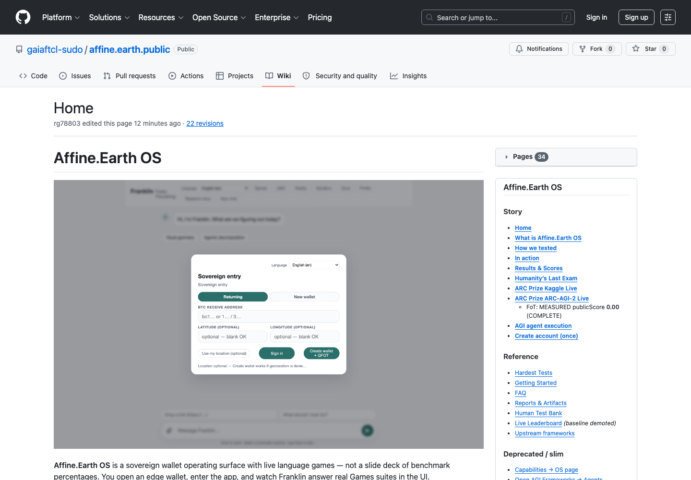

# ARC Prize 2026 (ARC-AGI-2) — Kaggle live record

Official competition: [ARC Prize 2026 — ARC-AGI-2](https://www.kaggle.com/competitions/arc-prize-2026-arc-agi-2)

**Submit status:** **BLOCKED** — `configs/NO_KAGGLE_SUBMIT.lock`. No new Kaggle submits until local mastery is green **and** the steward sets `ALLOW_KAGGLE_SUBMIT=1`.

## LOCAL mastery gate (required before any future submit)

| Gate | Result |
|:---|:---|
| Language-game doctrine | [Language-Games-ARC-AGI-2](Language-Games-ARC-AGI-2) · hub [Exam Invariants](Language-Games-Exam-Invariants) (`f983986`) |
| Top-score format study | [Kaggle-ARC-Top-Score-Formats](Kaggle-ARC-Top-Score-Formats) (`a04e483`) |
| Hard schema validator | `scripts/validate_arc_prize_submission.py` on fixture + official sample + local `submission.json` vs test challenges |
| Local harness | `bin/run-arc-local-mastery.sh` → `reports/arc_local_20260721T110813Z/` **overall GREEN** |
| Eval quality (local) | **1/172** exact grids (hybrid DSL + MIT arc-icecuber; was **0/172**) |
| Train quality (local) | **298/1076** exact grids (was **22/1076** DSL-only); **24/1000** DSL-licensed tasks |
| Engine | `harnesses/arc-icecuber` (MIT) + replay-gated Python DSL |
| Public probe | publicScore **0.00** = **PROCESS_PROBE** (premature process test) |
| LB contrast | Top public ~**65.83** — format≠mastery; local eval still far from LB |

```bash
./bin/run-arc-local-mastery.sh
# Emits reports/arc_local_*/agi2/submission.json (240 tasks) + language-game traces
# Never: kaggle competitions submit  (lock present)
```

UI context (Affine Formal/membrane — ARC grid exam not hosted in UI yet):




## Recorded 2026-07-21

| Check | Observed result |
|:---|:---|
| Competition entry | **Entered** — Kaggle reports `userHasEntered=True` |
| Official data | **Downloaded** — 240 test tasks, 120 evaluation tasks, and 1,000 training tasks |
| Package | `kaggle/arc-prize-2026-agi-2/` on `main`; public-repo code only |
| Submission contract | `submission.json` with `attempt_1` + `attempt_2` for every official test grid |
| Notebook | [Affine ARC Prize 2026 — ARC-AGI-2](https://www.kaggle.com/code/bliztafree/affine-arc-prize-2026-agi-2), **complete**, internet disabled |
| Competition submission | v1 was **accepted**; further submits **blocked** by lock |
| **Public score** | **0.00** — `SubmissionStatus.COMPLETE` — mark as **premature process probe** |

The package is separate from the ARC-AGI-3 notebook and contains no credentials
or private affine.earth OS source.

## Evidence

- Local schema validation: 240 official test tasks (hard gate green).
- Offline evaluation set: **1/172** exact grids (hybrid MIT icecuber+DSL; was 0/172).
- Notebook log: `evidence/arc-prize-2026-agi-2/kernel-output/affine-arc-prize-2026-arc-agi-2.log`
- Score receipt: `evidence/arc-prize-2026-agi-2/kaggle-submissions.csv` — publicScore `0.00`.
- Local mastery report: `reports/arc_local_20260721T110813Z/summary.json` — format validators **GREEN**; train **298/1076**; eval **1/172**; submit **LOCKED**.
- Contracts: [Top-score formats](Kaggle-ARC-Top-Score-Formats) · [Language Games ARC-AGI-2](Language-Games-ARC-AGI-2).
- Solver-quality lineage: `26a9758` → `7ab6e05` (DSL train 22/1076, eval 0/172) → main `db71c28` hybrid icecuber receipt **1/172** eval / **298/1076** train.

## 2026-07-21 local quality pass

The local replay-gated DSL now composes a geometry operation with a learned
color permutation, derives uniform scale/tile/reduce operations from training
dimensions, selects color or foreground connected-component crops, and tests
four gravity directions. Every candidate must reproduce every demonstration
before it can populate either answer slot.

This lifted the labeled training receipt from **12/1076** exact grids to
**19/1076** and licensed tasks from **13** to **20**. The held-out evaluation
receipt remains **0/172**; the requested eval lift was not observed, so quality
is recorded as **0/172**, not represented as a mastery win. The top-score JSON
and parquet validators stayed GREEN throughout. No new ARC exam UI surface
appeared, so the existing UI receipts remain current.

## 2026-07-21 held-out structural pass

Main commit: `7ab6e05` (`feat(arc): expand replay-gated structural DSL`).

The replay-gated DSL now also tests separator-line removal, left/right and
top/bottom reflection, background-preserving symmetry completion, and isolated
single-color components. Color fitting now composes after these object
selection rules as well as after geometry.

This increased the training receipt to **22/1076** exact grids and **24/1000**
licensed tasks. It did **not** license an evaluation task: evaluation remains
**0/172** at that SHA. Report: `reports/arc_local_20260721T105900Z/`.

## 2026-07-21 MIT arc-icecuber hybrid (eval > 0)

Vendored MIT [ARC-icecuber](https://github.com/victorvikram/ARC-icecuber) under
`harnesses/arc-icecuber` with a macOS/local adapter
(`llm_llvm_bench/arc/icecuber_adapter.py`). Hybrid mastery scores against
official evaluation/training solutions files (scoring contract verified).

Receipt: `reports/arc_local_20260721T110813Z/` — overall **GREEN**.

| Metric | Value |
| --- | --- |
| Eval exact | **1/172** (hit `981571dc`; DSL alone still 0/172) |
| Train exact | **298/1076** (icecuber 296 + DSL unique) |
| Failure analyses | `agi2/failure-case-analyses.json` (5 cases) |
| Submit | **LOCKED** — no Kaggle submit |

Prior 0/172 root cause: understanding/coverage gap (identity fallback on all
eval tasks), not a solutions-file scoring bug.

## Path forward

1. Keep `NO_KAGGLE_SUBMIT.lock`.
2. Grow search/DSL coverage past **1/172** eval (AGI-2 remains hard for depth-2 CPU search).
3. Re-run `./bin/run-arc-local-mastery.sh`; schema must stay green.
4. Steward re-opens submit only after explicit `ALLOW_KAGGLE_SUBMIT=1`.
