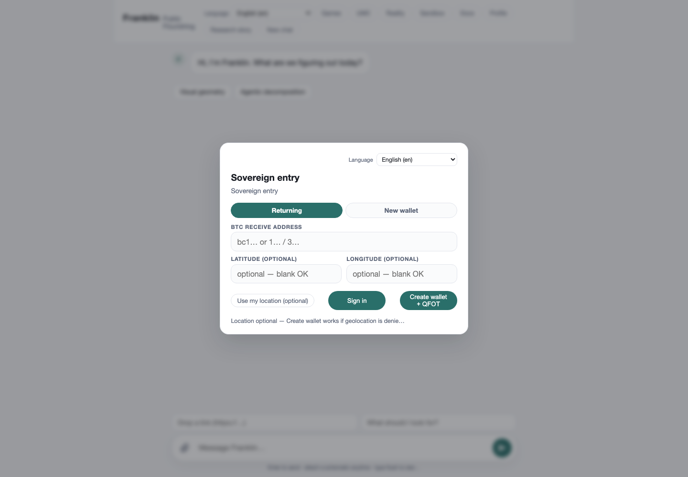
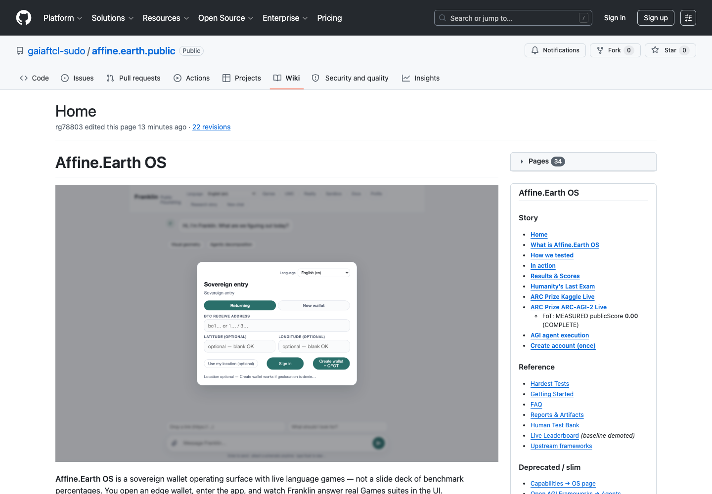

# ARC Prize 2026 (ARC-AGI-3) — Kaggle live record

Official competition: [ARC Prize 2026 - ARC-AGI-3](https://www.kaggle.com/competitions/arc-prize-2026-arc-agi-3)

**Format note:** ARC-AGI-3 is an interactive **agent** track. The air-gapped Kaggle output is `submission.parquet`, not classic ARC-AGI-2 `submission.json` with `attempt_1` / `attempt_2` grids. That grid contract belongs to [ARC-AGI-2](ARC-Prize-AGI-2-Kaggle-Live) (sibling track).

Auth for this record: `export KAGGLE_API_TOKEN=…` only. No Keychain / `security` / browser credential APIs.

**Submit status:** **BLOCKED** — `configs/NO_KAGGLE_SUBMIT.lock`. No new Kaggle submits until local mastery is green **and** the steward sets `ALLOW_KAGGLE_SUBMIT=1`.

## LOCAL mastery gate (required before any future submit)

| Gate | Result |
|:---|:---|
| Language-game doctrine | [Language-Games-ARC-AGI-3](Language-Games-ARC-AGI-3) · hub [Exam Invariants](Language-Games-Exam-Invariants) (`f983986`) |
| Top-score format study | [Kaggle-ARC-Top-Score-Formats](Kaggle-ARC-Top-Score-Formats) (`a04e483`) |
| Hard schema validator | `scripts/validate_arc_agi3_submission.py` on fixture + probe parquet |
| Local harness | `bin/run-arc-local-mastery.sh` → `reports/arc_local_20260721T105200Z/` **overall GREEN** (format validators; main `0af6775`) |
| Public probe | ref **54875048** publicScore **0.12** = **PROCESS_PROBE**, not perfected ownership |
| LB contrast | Top public ~**1.86** — format≠mastery |
| Sibling AGI-2 | Format GREEN; eval **0/172** mastery gap — [ARC-AGI-2 live](ARC-Prize-AGI-2-Kaggle-Live) |

```bash
./bin/run-arc-local-mastery.sh
# Hard gates first: fixtures → validate_arc_* → language-game traces
# Never: kaggle competitions submit  (lock present)
```

UI context (Affine membrane / Formal — ARC grids not hosted in UI yet):





## Recorded 2026-07-21 (post-join)

| Check | Observed result |
|:---|:---|
| Kaggle account | `bliztafree` |
| `userHasEntered` | **True** |
| Data download | **OK** — `arc-prize-2026-arc-agi-3.zip` (42 MB) under `data/arc-prize-2026/` (gitignored) |
| Competition input shape | Agent framework + `environment_files/` + wheels — **no** `*challenges*.json` |
| Local smoke | Official starter `make verify-local` → aggregate scorecard **0.0** (random baseline) |
| Kernel Phase A | **COMPLETE** — [bliztafree/arc-prize-2026-arc-agi-3-starter](https://www.kaggle.com/code/bliztafree/arc-prize-2026-arc-agi-3-starter) |
| Kernel constraints | `enable_internet=false`, GPU T4, competition source `arc-prize-2026-arc-agi-3` |
| Kernel output | `submission.parquet` (890 B on platform; local copy in evidence) |
| Competition submit | ref **54875048** — `SubmissionStatus.COMPLETE` (polled 2026-07-21T10:45:09Z) |
| Leaderboard / publicScore | **0.12** (platform `publicScore`; privateScore empty) — **process probe** |

Secret-free evidence under `evidence/arc-prize-2026/`:

- `download.log` — competition zip download
- `verify-local.log` — local agent smoke
- `kaggle-submit.log` — kernel push (Phase A)
- `kaggle-status-final.log` — `KernelWorkerStatus.COMPLETE`
- `kernel-output/submission.parquet` + kernel log
- `kaggle-competition-submit.log` / `kaggle-submissions.log` — Phase B ref `54875048`
- `kaggle-status-poll.log` — poll until COMPLETE; publicScore **0.12**
- `poll-result.env` / `submit-poll-stamp.txt` — terminal poll stamp

**Never commit `KAGGLE_API_TOKEN`.**

## FoT score (MEASURED process probe)

| Field | Value |
|:---|:---|
| Competition | `arc-prize-2026-arc-agi-3` |
| Submission ref | **54875048** |
| fileName | `submission.parquet` |
| status | `SubmissionStatus.COMPLETE` |
| publicScore | **0.12** |
| Label | **PROCESS_PROBE** — not perfected ownership |
| Top public LB (approx) | **~1.86** |
| Path forward | Local green → agent/policy mastery → steward re-opens submit |

## Report pin

- Local mastery: `reports/arc_local_20260721T105200Z/summary.json` — format validators **GREEN**; submit **LOCKED**
- Main hard-gate: `0af6775`
- Contracts: [Top-score formats](Kaggle-ARC-Top-Score-Formats) · [Language Games ARC-AGI-3](Language-Games-ARC-AGI-3)

## Reproduce (public test repo only — submit still locked)

```bash
export KAGGLE_API_TOKEN=…   # env only; never Keychain; DATA download only
./bin/run-arc-local-mastery.sh
# Submit path remains blocked by configs/NO_KAGGLE_SUBMIT.lock
```
