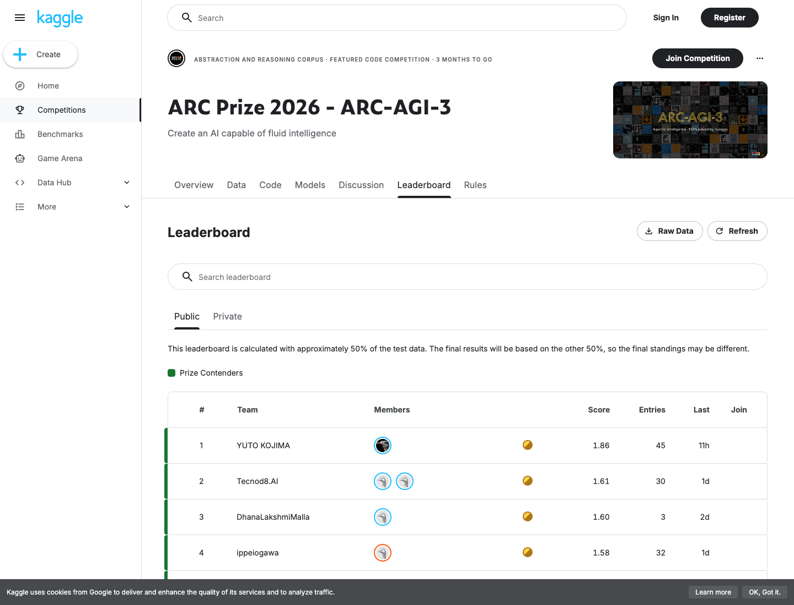
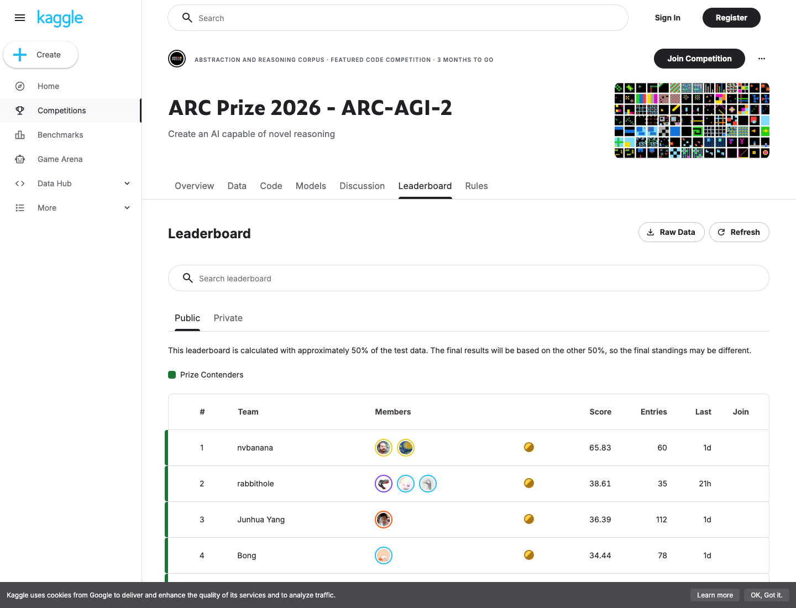
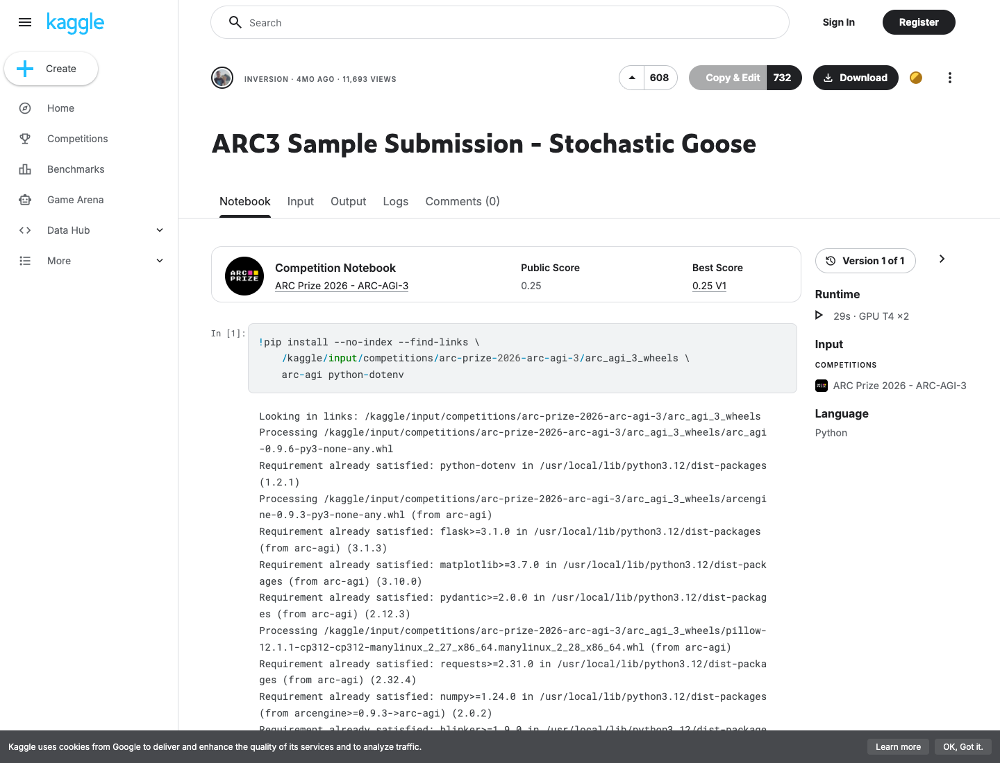

# Kaggle ARC — top-score submission formats

Local mastery documentation of the **typed answer artifacts** for ARC Prize
2026. Cross-links the language-game doctrine published at `f983986`.

**Local mastery pin:** `reports/arc_local_20260721T110813Z/` — format validators **GREEN**; AGI-2 hybrid eval **1/172**, train **298/1076**; AGI-3 probe **0.12**. Live records: [ARC-AGI-2](ARC-Prize-AGI-2-Kaggle-Live) · [ARC-AGI-3](ARC-Prize-Kaggle-Live). Games: [ARC-AGI-2](Language-Games-ARC-AGI-2) · [ARC-AGI-3](Language-Games-ARC-AGI-3).

**No competition submit** while [`configs/NO_KAGGLE_SUBMIT.lock`](../configs/NO_KAGGLE_SUBMIT.lock) is present.

| Doctrine | Page |
| --- | --- |
| Exam invariants | [Language-Games-Exam-Invariants](Language-Games-Exam-Invariants) |
| AGI-2 game | [Language-Games-ARC-AGI-2](Language-Games-ARC-AGI-2) |
| AGI-3 game | [Language-Games-ARC-AGI-3](Language-Games-ARC-AGI-3) |
| Full technical write-up | [`docs/KAGGLE_ARC_TOP_SCORE_FORMATS.md`](../docs/KAGGLE_ARC_TOP_SCORE_FORMATS.md) |
| Live AGI-3 score | [ARC-Prize-Kaggle-Live](ARC-Prize-Kaggle-Live) — **publicScore 0.12** |
| Live AGI-2 score | [ARC-Prize-AGI-2-Kaggle-Live](ARC-Prize-AGI-2-Kaggle-Live) — **publicScore 0.00** |

## Format correctness vs puzzle mastery (FoT)



| Signal | Value | Interpretation |
| --- | --- | --- |
| Our AGI-3 probe | ref **54875048**, **publicScore 0.12** | Schema-valid `submission.parquet` accepted and scored |
| Goose sample notebook | publicScore **0.25** | Same four-column parquet; better policy than our starter |
| AGI-3 LB #1 | **YUTO KOJIMA 1.86** | Puzzle/agent mastery on the same artifact language |
| Our AGI-2 baseline | **0.00** | Valid `attempt_1`/`attempt_2` JSON; no exact matches |
| AGI-2 LB #1 | **nvbanana 65.83** | Transformation mastery on the same JSON contract |



**Takeaway:** format green is a language-game serialization invariant. Moving
from 0.12 → ~1.8 (AGI-3) or 0.00 → ~65 (AGI-2) is understanding/policy work,
not a new file extension.

## Format from top scores — ARC-AGI-2

State change (see [Language-Games-ARC-AGI-2](Language-Games-ARC-AGI-2)):

```text
(D, X, h1, h2) → submission.json[task_id] = [{attempt_1: h1(x), attempt_2: h2(x)}]
```

| Field | Rule |
| --- | --- |
| File | `submission.json` |
| Nesting | `{task_id: [ {attempt_1, attempt_2}, … ]}` |
| Attempts | exactly those two keys per test input |
| Grid dtype | rectangular ints **0..9** |
| Score rule | either attempt may match |

Cited: official `sample_submission.json`; NVARC
[baseline notebook](https://www.kaggle.com/code/nihilisticneuralnet/baseline-nvarc-arc-25-winning-solution-for-t4x2);
[MCP starter](https://www.kaggle.com/code/ibrahimqasimi/mcp-arc-prize-agi-2-2026-starter).

Fixture: `fixtures/kaggle_arc_format/submission.json`.

## Format from top scores — ARC-AGI-3

State change (see [Language-Games-ARC-AGI-3](Language-Games-ARC-AGI-3)):

```text
validated episode trajectories → official serializer → submission.parquet
```



| Column | dtype | Commit-mode example |
| --- | --- | --- |
| `row_id` | string | `"1_0"` |
| `game_id` | string | `"1"` |
| `end_of_game` | bool | `True` |
| `score` | int64 | `1` |

Top notebooks (Goose, random agent, pscamillo, jeroencottaar) write that
exact column list when `KAGGLE_IS_COMPETITION_RERUN` is unset. On scored
rerun the gateway produces the real rows; the column contract stays the same.

Our probe evidence: `evidence/arc-prize-2026/kernel-output/submission.parquet`
→ **0.12**. Fixture: `fixtures/kaggle_arc_format/submission.parquet`.

## Local validators (fail loud)

```bash
python3 scripts/validate_arc_prize_submission.py fixtures/kaggle_arc_format/submission.json
python3 scripts/validate_arc_agi3_submission.py fixtures/kaggle_arc_format/submission.parquet
```

Verified AGI-3 suite parquet (2026-07-21 re-verify; lock still present):
`reports/arc_local_20260721T171426Z/submission.parquet` — scores 9/8/7.

Direct CLI submit is **BLOCKED** (Notebooks-only; steward unlock → HTTP 400).
Do **not** use `bin/kaggle-competitions-submit.sh`. Next path: air-gapped
kernels `kaggle/arc-prize-2026/` / `kaggle/arc-prize-2026-agi-2/` after UTC
quota reset — see `docs/ARC_LOCAL_100_SUBMIT_READY.md`. Lock stays.

Auth for status pulls only: `export KAGGLE_API_TOKEN=…` — never Keychain.
